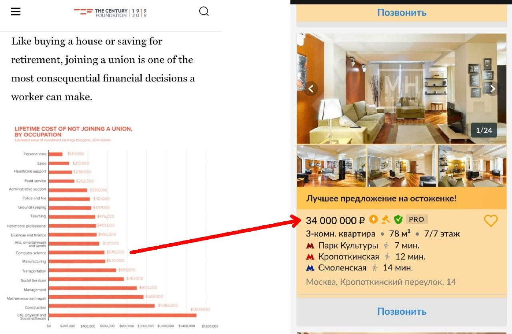

Сколько денег человек выигрывает в течение жизни благодаря присоединению к профсоюзу? Вряд ли на такой вопрос можно ответить в России, где независимое профсоюзное движение развито пока слабо, а "жёлтые" профсоюзы только раздают подарки на новый год и путёвки в санатории.

Зато в США, где традиции профессиональных объединений сохраняются уже многие десятки лет и охватывают десятки миллионов человек, выгоду можно посчитать очень точно, причём с разбивкой по отраслям экономики.

Именно это сделали исследователи из The Century Foundation в отчёте, скрин которого мы прикрепили к этому посту.

Как видите, айтишники в США по степени выгодности от объединения находятся на средних позициях (особенно, если учесть эту выгоду относительно зарплат). Но если считать абсолютно, то 570 000$ - это огромные деньги даже по меркам Штатов.

А если говорить о России, то посмотрите, какую квартиру вы могли бы себе позволить, если вы участвовали в работе профсоюза, а сами профсоюзы находились бы на том же уровне развития, что и в США.

Но пока мы с вами не объединены, все эти деньги от каждого работника идут в кубышку к боссам и акционерам.

[Ссылка на источник][source]  

[source]: https://tcf.org/content/report/virtual-labor-organizing/